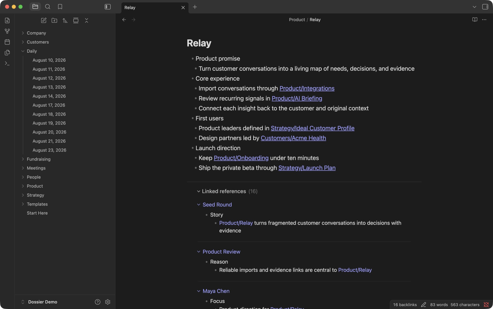
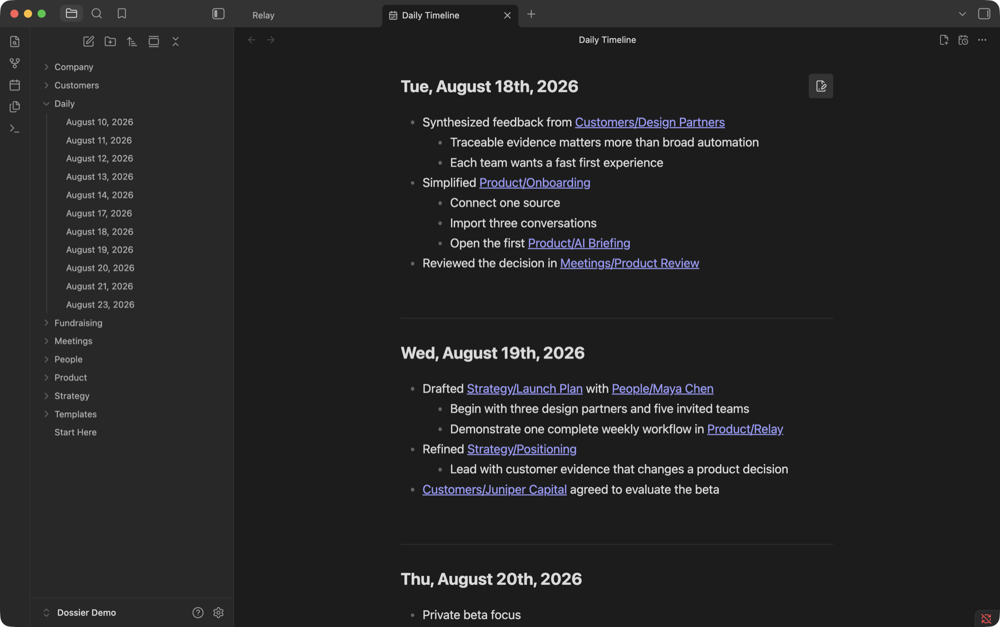
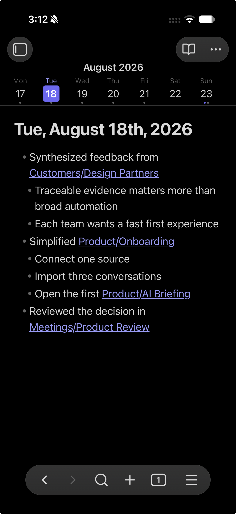
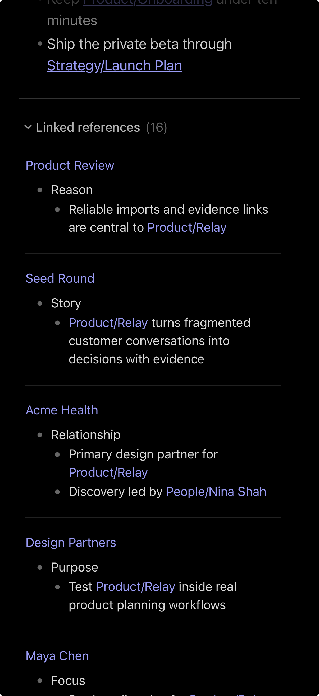

# Tradecraft

**A field kit for better backlinks and Daily Notes.**

Tradecraft adds three focused workflows to Obsidian: contextual backlinks that preserve the surrounding thought, human-readable Daily Note dates with compact navigation, and a continuous desktop timeline with inline editing.

Everything runs locally inside Obsidian. There are no accounts, network requests, telemetry, or external services.



## Dossier — understand backlinks in context

Obsidian tells you which notes link here. Dossier shows you what you were saying when you made the link.

Linked references appear below the current note as rendered excerpts. Source notes remain one click away, but routine context is readable without leaving the page.

- Works in Reading View and Live Preview on desktop and mobile
- Handles wiki links, aliases, heading and block links, and internal Markdown links
- Preserves useful structure from paragraphs, lists, tasks, quotes, callouts, and tables
- Tracks multiple references from one source and highlights every relevant occurrence
- Shows source-note and nearest-heading provenance
- Opens the exact source passage with native modifier-click and Page Preview behavior
- Supports compact, normal, and expanded context; source grouping; sorting; collapsing; pagination; and folder exclusions
- Updates after edits, creates, deletes, and renames

Dossier does not change either note merely to display a reference. It follows explicit links; unlinked mentions are outside its scope, and embeds are optional.

## Chronograph — Daily Notes made readable

Keep filenames predictable for the vault and dates readable for people. A file stored as `Daily/2026-08-20.md` can appear throughout Obsidian as **August 20, 2026** without renaming the file or changing links.

Readable dates can be enabled independently in:

- File Explorer
- tabs
- passive inline titles
- linked-reference source labels

Chronograph also adds a compact seven-day navigator on mobile and narrow windows. It pages exactly one week per gesture and supports touch, pointer, trackpad, mouse-wheel, and keyboard navigation. Monday- and Sunday-based weeks, sticky placement, reduced motion, and indicators for today, the selected date, and existing notes are configurable.

Selecting a missing date can show the same starter note without immediately creating a file. Tradecraft waits for a meaningful edit, so browsing dates does not fill the vault with empty notes. Existing blank Daily Notes are treated the same way, and matching core Daily Notes settings preserve templates when a note is committed.

## Logbook — a continuous Daily Timeline

On desktop, Logbook turns Daily Notes into one chronological workspace.



The timeline loads older and newer dates as you scroll while retaining a bounded window for performance. Existing notes render as native Markdown; missing and empty dates get lightweight, editable starters. It remembers its position, can open at startup, and can jump directly to today.

### Edit where the note lives

Select a note in the timeline and it becomes editable in place without shifting its layout. Only the focused date owns an editor; surrounding dates remain rendered.

The timeline editor includes:

- Live Preview-style rendering for links, formatting, lists, tasks, quotes, tags, highlights, comments, code, math, and media
- wiki-link completion with note, alias, heading, and block suggestions
- tag and slash-command completion
- rich paste, drag and drop, attachment import, list continuation, indentation, search, history, and familiar keybindings
- caret placement at the clicked text position
- debounced autosave and external-change conflict protection

Any date can still be opened in a normal Obsidian tab when the complete native editor or another plugin's editor integration is needed.

## Platform support

| Capability | Desktop | Mobile |
|---|:---:|:---:|
| Contextual linked references | Yes | Yes |
| Human-readable Daily Note dates | Yes | Yes |
| Seven-day navigator | Narrow windows | Yes |
| Continuous Daily Timeline | Yes | No |

### Mobile

| Daily Note navigation | Contextual linked references |
|---|---|
|  |  |

## Commands

- **Open Daily Timeline**
- **Toggle backlinks for current note**
- **Expand all references**
- **Collapse references**
- **Refresh references**

## Configuration

Tradecraft's settings cover linked-reference display and context, sorting and date detection, source and target exclusions, readable Daily Note surfaces, filename and display formats, week navigation, deferred note creation, and the timeline's startup and loaded-window behavior.

To explicitly hide or show contextual references on one note, set:

```yaml
---
contextual-backlinks: false
---
```

An explicit frontmatter value takes precedence over the global setting and command-created override.

## Installation

Until Tradecraft is available in Obsidian's Community Plugins directory, install a release manually:

1. Download `main.js`, `manifest.json`, and `styles.css` from the [latest GitHub release](https://github.com/mboyle/tradecraft/releases/latest).
2. Put them in `<your-vault>/.obsidian/plugins/dossier/`.
3. Reload Obsidian and enable the plugin under **Settings → Community plugins**.

## Privacy

Tradecraft is deterministic and local. It makes no network requests, collects no telemetry, and sends no vault content anywhere.

To provide contextual backlinks and native-feeling link, tag, heading, and block suggestions, Tradecraft enumerates Markdown file paths and Obsidian's cached metadata across the vault. It reads note contents only when needed to render or edit the notes and references currently in use.

## Development

Node.js 20 or newer and npm are required.

```sh
npm install
npm run dev
npm run check
npm run bench
```

For local development, place or symlink this repository at `<your-vault>/.obsidian/plugins/dossier/`, run `npm run dev`, and reload Obsidian.

## License

[MIT](LICENSE)
